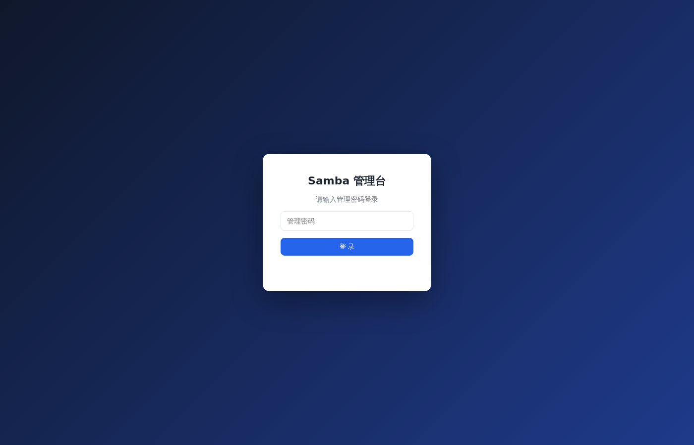

# Samba WebGUI

Rust 编写的单二进制 Samba Web 管理工具：通过浏览器管理共享文件夹、权限、共享用户，并支持共享内文件的上传、下载与 Quick Look 式预览（长按空格键）。



## 功能

| 模块 | 说明 |
|------|------|
| 共享管理 | 新建/编辑/删除共享；可写、访客(免密)、网络邻居可见、valid users、write list；可选自动修正目录属主/权限使写入真正生效 |
| 用户管理 | 新建/删除 Samba 用户（自动创建 nologin 系统用户）、改密、禁用/启用 |
| 文件浏览 | 按共享浏览目录，上传（带进度条）、下载（支持 Range 断点续传）、新建文件夹、删除（**移入共享回收站 .recycle，可恢复**） |
| 文件预览 | **选中文件后长按空格键（≥350ms）弹出预览，松开即关**；支持图片 / PDF / 文本代码 / 音频 / 视频 |
| 权限矩阵 | 群晖式「用户/组 × 无权限/只读/读写」勾选授权（→ valid users/write list/read list）；"自定义"列的 ⚙ 打开 POSIX ACL 编辑器对该用户/组做精细 rwx 授权 |
| 限制删除 | 共享级"限制删除（粘滞位）"：用户只能删除自己创建的文件（`chmod +t`，从目录 mode 反推回显）。注：per-user"可写不可删"非 Samba 原生能力，粘滞位是标准可行的实现 |
| ACL 控制 | 文件/目录级 POSIX ACL：按用户/组精细授权 rwx，支持默认 ACL（新建文件继承）与递归应用，Samba 侧 `inherit acls = yes` 保证 SMB 客户端新建文件同样继承 |
| 全局设置 | 监听地址、会话有效期、访客映射策略、**SMB 协议版本范围**（server min/max protocol，可禁用不安全的 SMB1）；写入前 testparm 校验、失败回滚 |
| SELinux | 监控大盘显示 SELinux 模式（enforcing/permissive/disabled）；共享对话框可选 **SELinux 上下文类型**（samba_share_t / public_content_rw_t / public_content_t / 不修改），勾选"自动修正权限"时给共享目录打该上下文（优先 `semanage fcontext`+`restorecon` 持久化，缺则退回 `chcon`），否则 SELinux 会拦住 Samba 访问；未启用 SELinux 时全程无操作 |
| 登录认证 | 管理密码登录（Argon2 哈希），HttpOnly + SameSite=Strict 会话 Cookie（有效期可配），60 秒内失败 5 次按来源 IP 锁定，**首次运行生成的默认密码强制修改后才能进入**，可在线改密；所有写操作/登录事件写入 **JSON Lines 审计日志**（data/audit.log） |

## 安全设计

- 分层配置结构：主 `smb.conf` 只管全局参数并在**文件末尾**注入一行 `include = /etc/samba/webgui-shares.conf`（首次注入前自动备份为 `smb.conf.webgui.bak`）；该聚合文件本身只含一串 `include` 行，**每个共享单独一个片段文件** `webgui-shares.d/<共享名>.conf`。改/删单个共享只动它自己的片段，互不影响，也便于用 git 独立追踪。旧版单文件格式启动时自动拆分为片段（幂等）
- 每次保存先 `testparm` 校验，失败自动回滚，成功后 `smbcontrol reload-config` 热加载
- 每次改配置（共享增删改 / 接管 / 全局访客策略）前自动快照到 `/etc/samba/webgui-backup/`（单级），共享页与全局设置页均有"↩ 还原上次配置"按钮，可一键撤销上一次改动——testparm 只能挡语法错，这个兜底能撤销"语法正确但设置错误导致连不上"的改动
- 主配置中已有的共享以"主配置"标记只读展示，不会被覆盖
- include 行固定放在 smb.conf **文件末尾**（samba 的 include 是线性文本包含，放在 [global] 中间会让后续全局参数被误归入共享段；旧位置会自动迁移，行尾注释也能识别、不会重复追加）
- 文件接口做路径规范化 + 越界检查：拒绝 `..`；已存在路径用规范化结果、不存在路径（上传/新建）则规范化**最近的已存在祖先**并校验，杜绝经中间符号链接写到共享外
- inline 预览响应带 `CSP: sandbox`，共享里的 html/svg 无法以管理台同源执行脚本
- 请求体上限：仅上传接口放开到 8 GiB（流式落盘），其余接口默认 2 MiB，未认证接口无法用大包耗内存
- 上传走"临时文件 + fsync + 原子 rename"：中断不会截断/清空原文件，并发同名上传不会写花
- 所有外部命令走参数数组且加 `--` 终止符（无 shell 注入、无选项注入）；配置字段与密码拒绝控制字符（防 CR/LF 注入 smb.conf 指令或截断 smbpasswd 输入）
- 禁止把系统关键目录（`/`、`/etc`、`/usr`、`/root` 等）**及其子目录**（如 `/etc/samba`、`/var/lib`）设为共享或对其 chmod/chown
- 解压校验双重防线：拒绝绝对路径/`..` 成员，并拒绝**符号链接/硬链接目标越界**（绝对路径或含 `..`），防解压产物指向共享外
- 登录限流按**来源 IP** 计（60 秒内失败 5 次锁该 IP），单一攻击者无法锁死管理员；映射有容量上限防膨胀
- 共享配置读改写全程持锁，并发保存不丢更新

## 数据与审计

- 运行数据目录为**当前工作目录下的 `data/`**：`config.json`（密码哈希与设置，**运行时自动生成，不入库**，仓库仅提供字段模板 `data/config.example.json`）、`audit.log`（JSON Lines 审计日志：登录成败/改密/共享/用户/组/配置变更/文件删除/解压/打包/服务控制/断连）。启动时会打印实际使用的数据目录绝对路径，**请始终从同一目录启动**，否则会生成新的默认密码并写入新目录
- 审计日志只追加不轮转，可定期清空或由外部 logrotate 处理

## 构建与运行

### 常规编译 (GNU/Linux)

```bash
cargo build --release
sudo ./target/release/samba-webgui          # 默认监听 0.0.0.0:8686
SWG_LISTEN=127.0.0.1:9000 sudo -E ./target/release/samba-webgui   # 自定义监听
```

### 低版本系统静态编译 (musl)

若需要在较老或低版本 Linux（如 CentOS 7/8、旧款 Debian/Ubuntu 或 Alpine、OpenWRT 等低/无 glibc 系统）上运行，请使用 `musl` 编译出完全静态链接、独立无依赖的单二进制文件：

```bash
# 方法一：内置构建脚本（自动加目标、编译、校验静态链接并生成 sha256）
./build-musl.sh                                   # x86_64
TARGET=aarch64-unknown-linux-musl ./build-musl.sh # ARM64

# 方法二：Makefile
make build-musl          # x86_64 musl 静态版
make build-musl-arm64    # ARM64 musl 静态版
make release             # 本机 glibc release + x86_64 musl 静态版一起产出

# 方法三：手动执行 Cargo 构建
rustup target add x86_64-unknown-linux-musl
cargo build --release --target x86_64-unknown-linux-musl
```

`.cargo/config.toml` 已为 musl 目标显式开启 `+crt-static`（仅作用于 musl 目标，不影响默认 glibc 开发构建）。编译产物位于 `dist/samba-webgui-<arch>-musl`，并附带同名 `.sha256` 校验文件；`file`/`ldd` 会确认其为 `statically linked`（无任何动态库依赖），可直接分发至目标低版本服务器 `sudo ./samba-webgui-x86_64-musl` 运行。

> 说明：本工具通过调用外部命令（`smbpasswd`/`pdbedit`/`getent`/`id` 等独立进程）完成用户与组操作，不在进程内做 glibc NSS 查询，因此 musl 静态版在功能上与 glibc 版完全一致。

---

首次启动生成默认管理密码 `admin123`（打印到控制台），**首次登录会被强制要求修改后才能进入主界面**。密码哈希存于运行目录 `data/config.json`。

需要 root（或等效权限）运行：写 `/etc/samba/`、调用 `smbpasswd`/`useradd`。

## 快捷键（文件浏览页）

| 键 | 动作 |
|----|------|
| ↑ / ↓ | 移动选中 |
| Enter | 进入目录 |
| Backspace | 返回上级 |
| **长按空格** | 预览选中文件（松开关闭） |
| Esc | 关闭预览 |

## API 概览

`POST /api/login` `POST /api/logout` `POST /api/password` — 认证
`GET/POST /api/shares` `PUT/DELETE /api/shares/{name}` — 共享
`GET/POST /api/users` `DELETE /api/users/{name}` `PUT /api/users/{name}/password|enable` — 用户
`GET /api/files` `GET /api/files/download` `POST /api/files/upload|mkdir|delete` — 文件
`GET/POST /api/files/acl` — ACL 查看与 set/remove/clear（需系统安装 `acl` 包）

所有写操作需登录会话（`sid` Cookie）。
